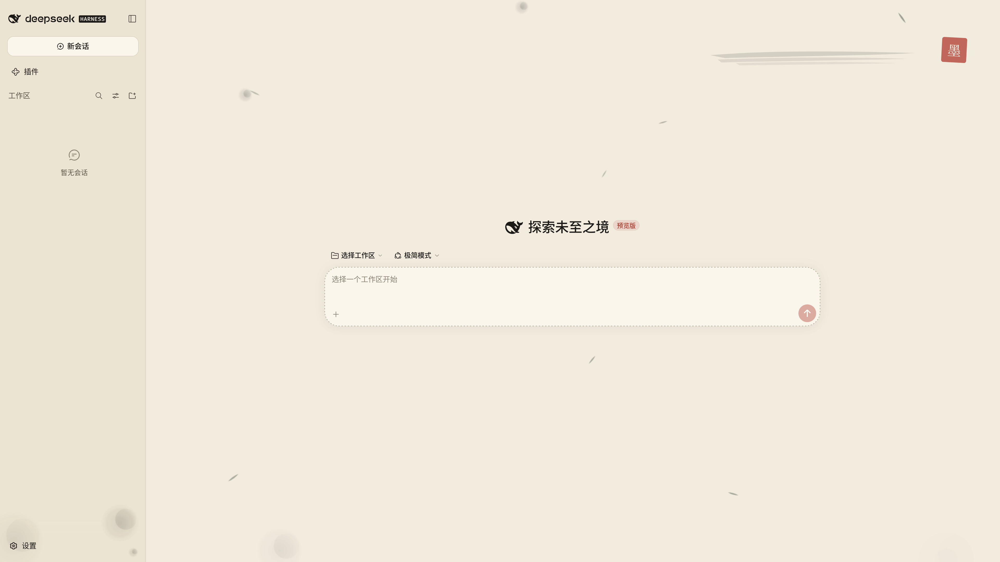

# dsh-theme-ink

Ink wash (水墨) theme plugin for the DeepSeek Harness Web UI: opaque
rice-paper panels with a vermilion seal and dry-brush strokes floating above
the content, plus blooming ink drops and falling bamboo leaves. Fonts follow
the DSH defaults.

The theme is enabled while the plugin is installed (no toggle) — disable or
remove the plugin to restore the default theme.



## Install

Install into a web profile (purely browser-side; no host-side service
dependencies):

```sh
dsh plugin --profile web add github:jiangwangyang/dsh-theme-ink
```

Refresh the Web UI. The theme activates immediately; disable or remove the
plugin from plugin management to revert.

## How it works

The theme is purely browser-side: the host half (`src/index.js`) is an empty
implementation carrying only the enable/disable logs; all logic lives in a
single build-free client bundle (`src/client/index.js`):

- **Token override layer**: stacks the ink palette on the current theme via
  `ctx.theme.overrideTokens` (orthogonal to the light/dark/system preference;
  no theme id is registered and no preference is touched), and asserts a light
  color-scheme chrome after every `theme/change`. Everything is reverted on
  unload.
- **Structure layer** (inlined stylesheet `STRUCTURE_CSS`, formerly
  `assets/ink.css`): gated by `html[data-dsh-ink]` — shiki ink-highlight
  tokens and a top fx layer (`z-index: 9998`, `pointer-events: none`) holding
  the vermilion seal, dry-brush strokes and the particle canvas above all
  content. Panels are opaque paper colors via the token overlay; there is no
  backdrop layer.
- **Renderer** (`createInkRenderer()`, inlined, formerly `assets/ink.js`):
  creates the fx layer with seal and canvas; a lightweight 2D-canvas particle
  loop (30fps cap) — blooming ink drops at the canvas edges and swaying bamboo
  leaves, ported from the openagents ink theme. Degrades to a static frame
  under `prefers-reduced-motion`.

The stylesheet and renderer are inlined into the client bundle and arrive with
the client plugin — no static asset routes, no index.html injection, no
`window` global controller; the trade-off is a possible brief flash of the
default theme before the bundle loads.

## License

MIT
